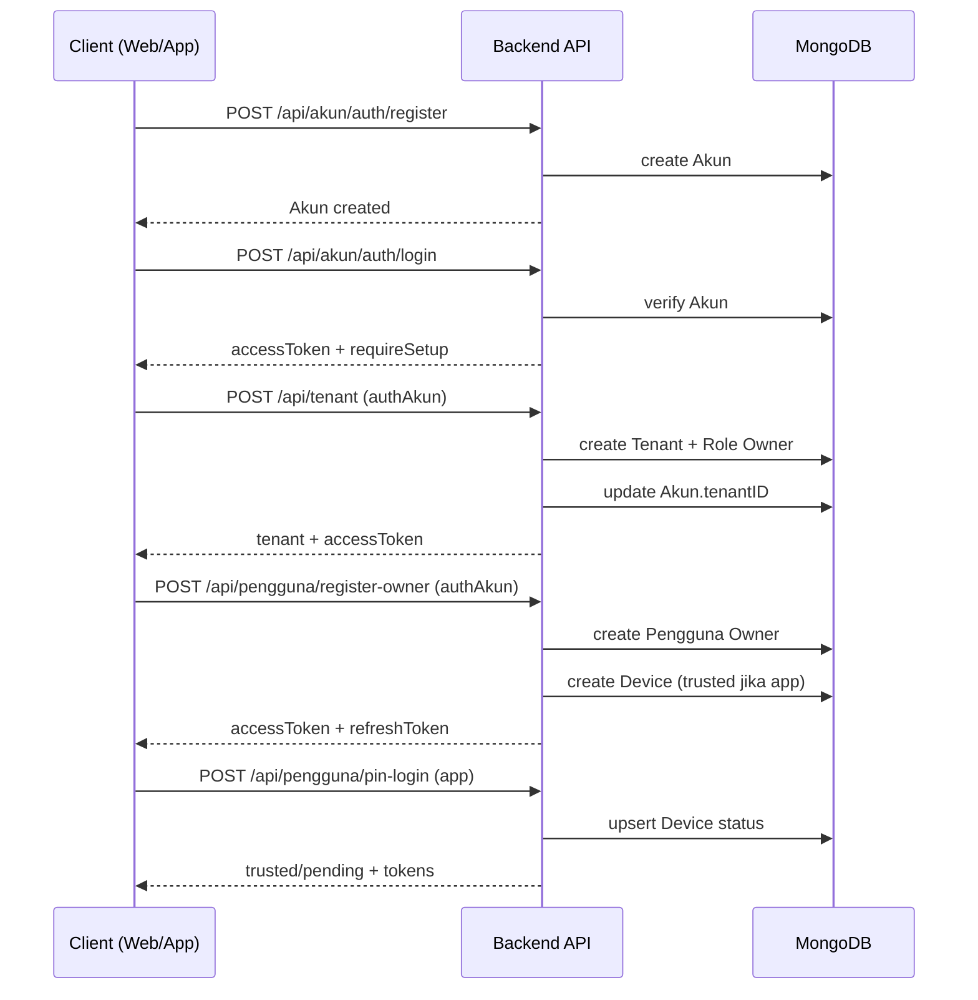

# Alur Akun Baru -> Tenant -> Owner -> Device

Dokumen ini menjelaskan alur backend saat akun SaaS pertama kali dibuat, tenant dibuat, owner dibuat, dan perangkat (device) pertama kali login di aplikasi.

## Ringkasan Entitas

- Akun: identitas SaaS (email/password) untuk setup awal tenant. Lihat [services/akunService.js](services/akunService.js) dan [controllers/akunController.js](controllers/akunController.js).
- Tenant: data toko dan batas tenant. Lihat [services/tenantService.js](services/tenantService.js) dan [controllers/tenantController.js](controllers/tenantController.js).
- Pengguna (Owner/Kasir): user operasional yang login dengan PIN. Lihat [services/penggunaService.js](services/penggunaService.js) dan [controllers/penggunaController.js](controllers/penggunaController.js).
- Device: binding perangkat untuk login app (trusted/pending/revoked). Lihat [services/deviceService.js](services/deviceService.js) dan [models/deviceModel.js](models/deviceModel.js).

## Base Path API

Semua route dimount di /api dan path diturunkan otomatis dari nama file route. Lihat [app.js](app.js) dan [routes/index.js](routes/index.js).

## Alur Utama (End-to-End)

### 1) Registrasi Akun SaaS

- Endpoint: POST /api/akun/auth/register
- Auth: public
- Proses utama:
  - Validasi payload dan cek email unik.
  - Buat record Akun dengan tenantID null (belum setup tenant).

Detail proses:
- Validator: validateRegister di [services/akunService.js](services/akunService.js) memastikan format email, password, dan opsional username.
- Unik email dicek di koleksi Akun, jika sudah ada -> 409.
- Akun baru disimpan dengan role default client, tenantID null, dan tokenVersion awal.
- Response menghapus field sensitif seperti password.

Request body (contoh minimal):
```json
{
  "email": "owner@contoh.com",
  "password": "Rahasia123"
}
```

Request body (contoh lengkap):
```json
{
  "email": "owner@contoh.com",
  "password": "Rahasia123",
  "username": "toko-utama",
  "role": "client"
}
```

Response sukses (201) - ringkas:
```json
{
  "message": "Registrasi berhasil.",
  "data": {
    "_id": "...",
    "email": "owner@contoh.com",
    "username": "toko-utama",
    "role": "client",
    "tenantID": null,
    "tokenVersion": 0
  }
}
```

Error umum:
- 409: Email sudah terdaftar.
- 400: Payload tidak valid.

Rujukan: [routes/akunRoute.js](routes/akunRoute.js), [services/akunService.js](services/akunService.js).

### 2) Login Akun SaaS

- Endpoint: POST /api/akun/auth/login
- Auth: public
- Proses utama:
  - Validasi email/password.
  - Generate accessToken dan refreshToken.
  - Jika tenantID masih null, response mengandung flag requireSetup true.

Detail proses:
- Validator: validateLogin di [services/akunService.js](services/akunService.js).
- Jika email tidak ditemukan -> 404. Jika password salah -> 400.
- tokenVersion di Akun di-rotate (Date.now) agar sesi lama invalid.
- accessToken berisi id, role, version, dan tenantID jika sudah ada.
- refreshToken JWT disimpan di cookie httpOnly.

Request body:
```json
{
  "email": "owner@contoh.com",
  "password": "Rahasia123"
}
```

Response sukses (200) - akun belum setup tenant:
```json
{
  "message": "Login berhasil. Anda belum melakukan setup toko, silakan setup di /api/tenant.",
  "data": {
    "_id": "...",
    "email": "owner@contoh.com",
    "username": "toko-utama",
    "role": "client",
    "tenantID": null,
    "tokenVersion": 1716980000000
  },
  "accessToken": "<jwt>",
  "requireSetup": true
}
```

Response sukses (200) - akun sudah punya tenant:
```json
{
  "message": "Login berhasil.",
  "data": {
    "_id": "...",
    "email": "owner@contoh.com",
    "username": "toko-utama",
    "role": "client",
    "tenantID": "...",
    "tokenVersion": 1716980000000
  },
  "accessToken": "<jwt>",
  "requireSetup": false
}
```

Cookie refreshToken:
- Nama cookie: refreshToken
- Path: /api/akun/auth
- httpOnly: true
- sameSite: strict

Error umum:
- 404: Email tidak ditemukan.
- 400: Password salah.
- 400: Payload tidak valid.

Rujukan: [controllers/akunController.js](controllers/akunController.js), [services/akunService.js](services/akunService.js).

### 3) Buat Tenant (Setup Toko Pertama)

- Endpoint: POST /api/tenant
- Auth: authAkun (Bearer token dari login akun)
- Proses utama:
  - Validasi payload tenant.
  - Pastikan akun belum memiliki tenant.
  - Buat Tenant.
  - Buat Role Owner untuk tenant tersebut, dengan seluruh permission.
  - Update Akun agar tenantID terisi.
  - Generate accessToken baru untuk akun (terikat tenant).

Detail proses:
- Validator: validateTenantPayload di [services/tenantService.js](services/tenantService.js).
- Akun wajib ada dan belum punya tenantID. Jika sudah terikat -> 400.
- Sistem mengambil semua permission dari koleksi Permission, lalu membuat Role Owner dengan semua permission.
- Akun di-update agar tenantID terisi agar token berikutnya membawa context tenant.
- Cache daftar tenant di-reset.
- Jika terjadi error di tengah (misal gagal buat role), tenant dan role yang sempat dibuat akan dibersihkan.

Request body (contoh minimal):
```json
{
  "namaToko": "Toko Utama"
}
```

Request body (contoh lengkap):
```json
{
  "namaToko": "Toko Utama",
  "alamat": "Jl. Merdeka 123",
  "kota": "Bandung",
  "kodePos": "40123",
  "nomorTelepon": "08123456789",
  "emailBisnis": "cs@toko.com",
  "logoUrl": "https://cdn.toko.com/logo.png",
  "footerStruk": "Terima kasih",
  "idNPWP": "12.345.678.9-012.345",
  "persenPajak": 10,
  "tipePajak": "Sudah Termasuk (Inclusive)"
}
```

Response sukses (201) - ringkas:
```json
{
  "message": "Registrasi toko dan owner berhasil.",
  "data": {
    "tenant": {
      "_id": "...",
      "namaToko": "Toko Utama",
      "status": "aktif",
      "isSetupComplete": false
    },
    "owner": {
      "id": "...",
      "email": "owner@contoh.com"
    },
    "accessToken": "<jwt>"
  }
}
```

Error umum:
- 400: Akun sudah memiliki tenant.
- 400: Payload tenant tidak valid.
- 500: Permission system kosong atau gagal membuat role.

Rujukan: [routes/tenantRoute.js](routes/tenantRoute.js), [services/tenantService.js](services/tenantService.js), [models/roleModel.js](models/roleModel.js).

### 4) Buat Owner (Pengguna Owner)

Catatan penting: Device hanya terkait Pengguna (PIN login), bukan Akun SaaS. Jadi pembuatan owner harus terjadi sebelum device login app.

- Endpoint: POST /api/pengguna/register-owner
- Auth: authAkun (tenant context dari token akun)
- Proses utama:
  - Cek role Owner ada untuk tenant.
  - Cek nama unik dalam tenant.
  - Buat Pengguna Owner (PIN di-hash).
  - Jika aksesType termasuk app, maka installationId wajib dan Device dibuat langsung dengan status trusted.
  - Generate accessToken pengguna (loginType app) dan refreshToken (opaque) untuk device.

Detail proses:
- Endpoint ini hanya boleh diakses oleh akun SaaS yang sudah terikat tenant (authAkun).
- aksesType dinormalisasi menjadi array, default ["app"].
- Jika aksesType mengandung app, installationId wajib. Jika tidak ada -> 400.
- Transaksi MongoDB digunakan agar pembuatan pengguna dan device bersifat atomic.
- Device pertama untuk Owner dibuat dengan status trusted, approvedAt dan approvedBy diisi owner sendiri.
- Refresh token app adalah opaque token, disimpan sebagai hash di device.

Request body (contoh minimal, app):
```json
{
  "nama": "Owner Toko",
  "pin": "123456",
  "aksesType": ["app"],
  "installationId": "uuid-install-1",
  "deviceName": "Owner iPhone",
  "appVersion": "1.0.0",
  "osVersion": "iOS 17"
}
```

Request body (contoh web saja):
```json
{
  "nama": "Owner Toko",
  "pin": "123456",
  "aksesType": ["web"]
}
```

Response sukses (201) - ringkas:
```json
{
  "success": true,
  "message": "Owner berhasil didaftarkan.",
  "data": {
    "pengguna": {
      "id": "...",
      "nama": "Owner Toko",
      "aksesType": ["app"],
      "role": "Owner",
      "status": "aktif"
    },
    "device": {
      "installationId": "uuid-install-1",
      "status": "trusted"
    }
  },
  "accessToken": "<jwt>",
  "refreshToken": "<opaque>"
}
```

Error umum:
- 404: Role Owner tidak ditemukan (tenant belum dibuat).
- 400: Nama sudah digunakan di tenant.
- 400: installationId wajib untuk akses app.

Rujukan: [routes/penggunaRoute.js](routes/penggunaRoute.js), [services/penggunaService.js](services/penggunaService.js), [models/penggunaModel.js](models/penggunaModel.js), [models/deviceModel.js](models/deviceModel.js).

### 5) Device Pertama Kali Login (App)

- Endpoint: POST /api/pengguna/pin-login
- Auth: authAkun (level akun, tenant context dipakai untuk login screen dan validasi)
- Payload penting: nama, pin, loginType=app, installationId, deviceName, appVersion, osVersion
- Proses utama (loginType=app):
  - Validasi kredensial nama/pin.
  - Jika device sudah ada:
    - revoked: ditolak.
    - pending dan belum expire: kembalikan status pending.
    - trusted: rotasi refreshToken hash, update metadata, terbitkan accessToken baru.
  - Jika device belum ada:
    - Cek kuota device aktif.
    - Jika ini device pertama (activeDeviceCount=0) -> status trusted (auto-bind / TOFU).
    - Jika bukan pertama -> status pending + pendingExpiresAt 7 hari.

Detail proses:
- loginType harus spesifik satu: "web" atau "app". Jika array lebih dari 1 -> 400.
- Untuk app wajib menyertakan installationId.
- Saat device sudah trusted, refreshToken dirotasi dan disimpan sebagai hash (HMAC SHA-256).
- Perangkat baru pertama kali (TOFU) langsung trusted dan menerima token.
- Perangkat ke-2 dst masuk status pending dan butuh approval (owner/manager).
- Kuota device per user dikontrol oleh env MAX_DEVICES_PER_USER (default 3).

Request body (contoh app):
```json
{
  "nama": "Owner Toko",
  "pin": "123456",
  "loginType": "app",
  "installationId": "uuid-install-1",
  "deviceName": "Owner iPhone",
  "appVersion": "1.0.0",
  "osVersion": "iOS 17"
}
```

Response sukses (trusted):
```json
{
  "success": true,
  "message": "Login berhasil.",
  "data": {
    "user": {
      "id": "...",
      "nama": "Owner Toko",
      "aksesType": ["app"],
      "role": "Owner",
      "status": "aktif"
    },
    "device": {
      "installationId": "uuid-install-1",
      "status": "trusted"
    }
  },
  "accessToken": "<jwt>",
  "refreshToken": "<opaque>"
}
```

Response status pending:
```json
{
  "success": false,
  "code": "DEVICE_PENDING_APPROVAL",
  "message": "Perangkat menunggu persetujuan owner.",
  "data": {
    "installationId": "uuid-install-2",
    "pendingExpiresAt": "2026-06-05T00:00:00.000Z"
  }
}
```

Error umum:
- 401: Nama atau PIN salah.
- 401: Perangkat revoked.
- 403: Kuota device penuh.

Rujukan: [controllers/penggunaController.js](controllers/penggunaController.js), [services/penggunaService.js](services/penggunaService.js), [config/constants.js](config/constants.js).

### 6) Approve / Revoke Device (Jika Pending)

- Endpoint:
  - POST /api/device/approve (butuh izin update-pengguna)
  - POST /api/device/revoke (butuh izin update-pengguna)
  - POST /api/device/self-approve (tanpa permission, tapi harus authPengguna)
- Proses utama:
  - Validasi tenant isolation.
  - Cek kuota device sebelum trusted.
  - Update status device menjadi trusted atau revoked.

Detail proses:
- Semua endpoint memakai authPengguna, sehingga memerlukan accessToken pengguna (hasil login PIN).
- approve/revoke dicek izin update-pengguna (Owner/Manager).
- approve/revoke melakukan isolasi tenant agar tidak bisa lintas tenant.
- self-approve hanya untuk device milik pengguna itu sendiri, tanpa permission.

Request body approve/revoke:
```json
{
  "installationId": "uuid-install-2"
}
```

Response sukses approve:
```json
{
  "success": true,
  "message": "Perangkat berhasil disetujui dan kini memiliki status Trusted.",
  "data": {
    "installationId": "uuid-install-2",
    "status": "trusted"
  }
}
```

Response sukses revoke:
```json
{
  "success": true,
  "message": "Akses perangkat berhasil dicabut. Sesi telah diputus secara paksa.",
  "data": {
    "installationId": "uuid-install-2",
    "status": "revoked"
  }
}
```

Error umum:
- 403: Kuota device penuh saat approve.
- 404: Device tidak ditemukan atau lintas tenant.
- 403: Device revoked tidak bisa approve ulang.

Rujukan: [routes/deviceRoute.js](routes/deviceRoute.js), [services/deviceService.js](services/deviceService.js).

## Mermaid: Sequence Ringkas



## Catatan Teknis (Ringkas)

- Auth Akun memakai token version di Akun. Lihat [middleware/authAkun.js](middleware/authAkun.js).
- Auth Pengguna memakai token loginType dan cek device trusted untuk app. Lihat [middleware/authPengguna.js](middleware/authPengguna.js).
- Refresh token app adalah opaque token yang di-hash di Device. Lihat [services/penggunaService.js](services/penggunaService.js).
